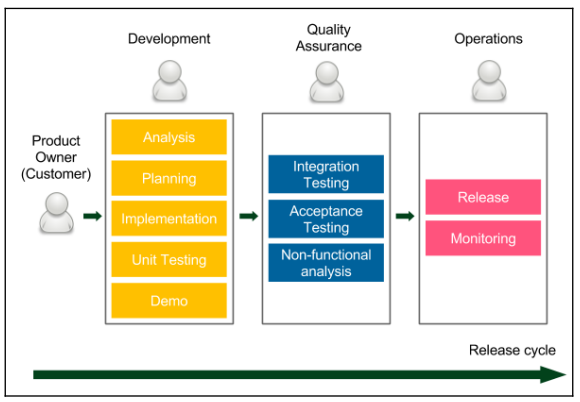
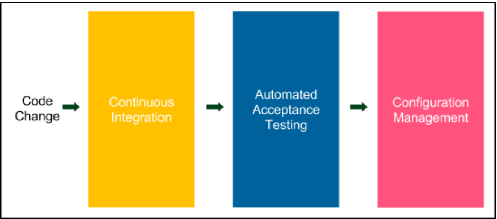

# 1) Continous Delivery(CD) 소개
지속적 인도란 새로운 기능추가나 구성의 변경, 버그 수정이나 기능 실험을 포함한 **모든 유형의 변화를 통제하면서 제품을 생산하는 역량** 또는 **사용자에게 빠르고 안전하고 안정적으로 제공하는 역량**이다.  
 -**Jez Humble**-

## 전통적 Delivery 프로세스의 Release Cycle
 
 ### 1. **Product Owner의 요구 사항 발생 (우리 용어로 치면 RFP)**
 - **요구 사항**

 ### 2. **개발 단계 : 개발자가 제품을 구현**
 - **스크럼**
 - **칸반**
 - **애자일 기법**
 - **이해관계자 의견 소통**
 - **제품 시연**
 - **익스트림 프로그래밍 실전법 도입**

 ### 3. **품질 보증 단계 : Quality Assurance(QA) 팀이 수행**
 - **User Acceptance Test(UAT)** 라고도 부름
 - **통합 테스트**
 - **인수 테스트**
 - **비기능 분석(SW의 품질을 의미함 일례 : 성능, 복구, 보완 등)**

 ### 4. **운영 단계**
 - **제품 Release**
 - **모니터링**
 - **문제 발생 시 개발자 호출**

 ### 전체 단계의 기간 (3개월 ~ 4개월, 방산 기술 개발 에 비하면 짧음 :question:)
 - 개발 기간 : 1.5 개월
 - UAT 기간 : 3주 ~ 1개월
 - Release 기간 : 1주

## 전통적 Delivery 프로세스의 Release Cycle 단점

1. 느린 Delivery 기간 : 제품을 판매해서 고객의 의견을 받기까지의 기간이 길다.
2. 느린 피드백 주기 : 개발자는 UAT 단계가 돼서야 자신이 만들어 낸 버그를 알게됨 (제일 중요!! 우리로 치면 CDR 끝나고 개발 신나게 해서 통합했더니 안되는 상황임 :boom::shit:)
3. 자동화 미비 : Release 한번 한번에 모두의 공수(개발자, QA, 전달자)가 필요함, Release Cycle 예측도 힘듬
4. 위험한 핫픽스 : 긴급히 수정해야 하는 경우에는 UAT 까지 모두 수행하기 힘듬, 간단한 테스트만 하는 상황이 많음
5. 스트레스 : Release Cycle 관여자 모두 :scream_cat:
6. 의사소통 부족 : Waterfull Model 을 따르기 때문에 한 팀에서 다른 팀으로 전달되면 제품의 완성도 보다는 본인이 맡은 부분만 잘하려고 함 (너무 공감됨)
7. 책임의 분산 : 어느 팀도 제품 전체의 완성도를 책임지지 않음.
8. 낮은 업무 만족도 : 개발 팀만 재밌고, 다른 팀은 성장하는 느낌이 없음
 
 ## Continous Delivery(CD)의 장점
 CD의 핵심은 파이프라인을 만들고 전통적 Delivery 각 단계를 1개의 컴포넌트로 자동화 하는 것이 핵심임. **(개발 -> QA -> 배포)** 

 ### 장점
 1. 빠른 제품 Delivery : CD 파이프라인을 구축했다면 1번의 파이프라인이 성공적으로 끝날 경우에 바로 배포함!
 2. 빠른 피드백 Cycle : 배포후 버그가 있다면? 코드 수정 후 이미 자동화한 파이프라인에 의해 테스트 배포 모두 빠르게 됨
 3. 위험도가 낮은 Release : 파이프라인에의해 Cycle이 형성되었기 때문에 지속적인 Release가 되었음으로 위험도가 낮음 
 4. 유연한 Release  : Relase를 급히해야하는 경우 추가 시간, 비용이 필요없음.

## 자동 배포 파이프라인

자동 배포 파이프라인은 3단계로 구성됨
1. Continuouse Intergration(CI) : 각기 다른 개발자가 작성한 코드가 통합됐는지 확인하는 단계 
2. Automated Acceptance Testing : 개발자가 구현한 기능이 고객의 요구 사항과 맞는지 확인하는 단계 
3. Configuration Management : 환경을 구성하고, 소프트웨어를 배포한다.
   
### Continuous Integration
bla bla ~
### Automated Acceptance Testing
bla bla ~
### Configuration Management
bla bla ~

