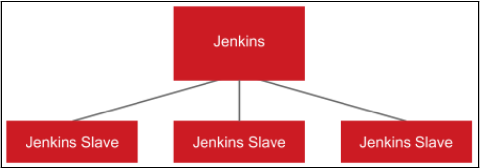
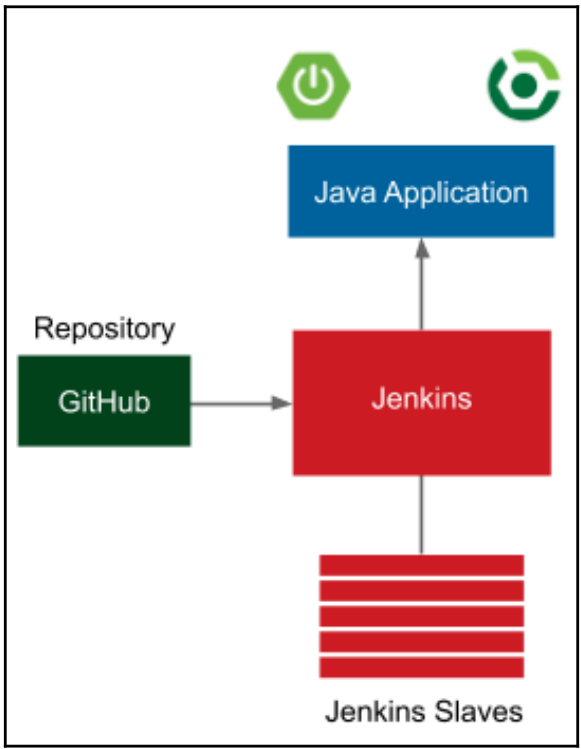
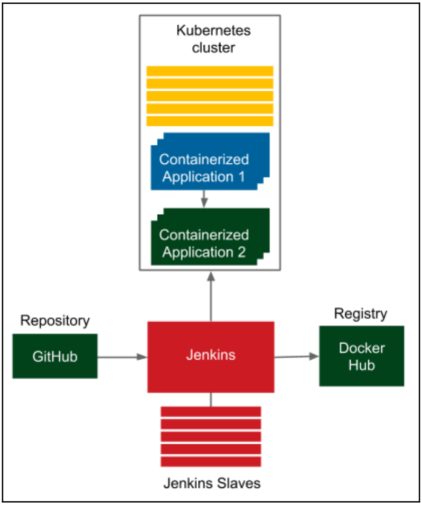
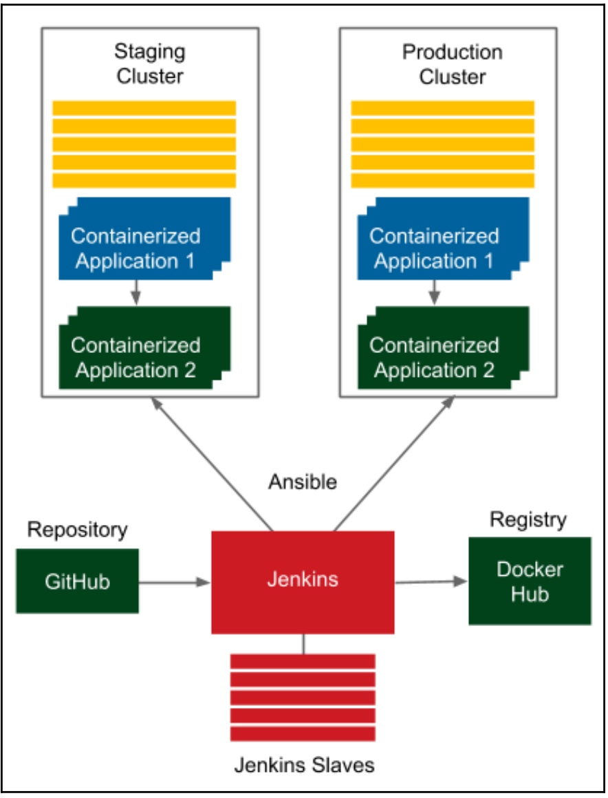
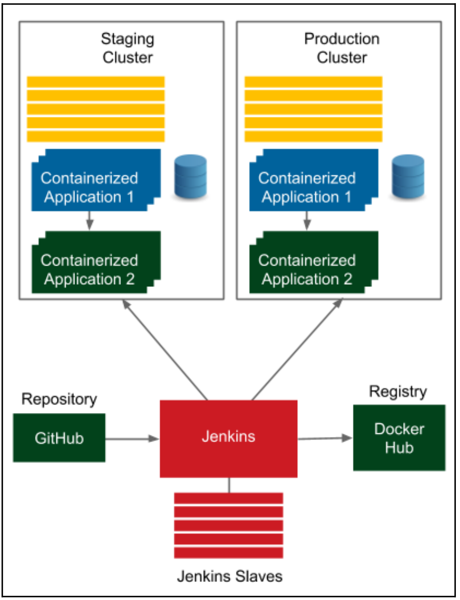

# 1) Continous Delivery(CD) 소개
지속적 인도란 새로운 기능추가나 구성의 변경, 버그 수정이나 기능 실험을 포함한 **모든 유형의 변화를 통제하면서 제품을 생산하는 역량** 또는 **사용자에게 빠르고 안전하고 안정적으로 제공하는 역량**이다.  
 -**Jez Humble**-

## 전통적 Delivery 프로세스의 Release Cycle
 
 ### 1. **Product Owner의 요구 사항 발생 (우리 용어로 치면 RFP)**
 - **요구 사항**

 ### 2. **개발 단계 : 개발자가 제품을 구현**
 - **스크럼**
 - **칸반**
 - **애자일 기법**
 - **이해관계자 의견 소통**
 - **제품 시연**
 - **익스트림 프로그래밍 실전법 도입**

 ### 3. **품질 보증 단계 : Quality Assurance(QA) 팀이 수행**
 - **User Acceptance Test(UAT)** 라고도 부름
 - **통합 테스트**
 - **인수 테스트**
 - **비기능 분석(SW의 품질을 의미함 일례 : 성능, 복구, 보완 등)**

 ### 4. **운영 단계**
 - **제품 Release**
 - **모니터링**
 - **문제 발생 시 개발자 호출**

 ### 전체 단계의 기간 (3개월 ~ 4개월, 방산 기술 개발 에 비하면 짧음 :question:)
 - 개발 기간 : 1.5 개월
 - UAT 기간 : 3주 ~ 1개월
 - Release 기간 : 1주

## 전통적 Delivery 프로세스의 Release Cycle 단점

1. 느린 Delivery 기간 : 제품을 판매해서 고객의 의견을 받기까지의 기간이 길다.
2. 느린 피드백 주기 : 개발자는 UAT 단계가 돼서야 자신이 만들어 낸 버그를 알게됨 (제일 중요!! 우리로 치면 CDR 끝나고 개발 신나게 해서 통합했더니 안되는 상황임 :boom::shit:)
3. 자동화 미비 : Release 한번 한번에 모두의 공수(개발자, QA, 전달자)가 필요함, Release Cycle 예측도 힘듬
4. 위험한 핫픽스 : 긴급히 수정해야 하는 경우에는 UAT 까지 모두 수행하기 힘듬, 간단한 테스트만 하는 상황이 많음
5. 스트레스 : Release Cycle 관여자 모두 :scream_cat:
6. 의사소통 부족 : Waterfull Model 을 따르기 때문에 한 팀에서 다른 팀으로 전달되면 제품의 완성도 보다는 본인이 맡은 부분만 잘하려고 함 (너무 공감됨)
7. 책임의 분산 : 어느 팀도 제품 전체의 완성도를 책임지지 않음.
8. 낮은 업무 만족도 : 개발 팀만 재밌고, 다른 팀은 성장하는 느낌이 없음
 
 ## Continous Delivery(CD)의 장점
 CD의 핵심은 파이프라인을 만들고 전통적 Delivery 각 단계를 1개의 컴포넌트로 자동화 하는 것이 핵심임. **(개발 -> QA -> 배포)** 

 ### 장점
 1. 빠른 제품 Delivery : CD 파이프라인을 구축했다면 1번의 파이프라인이 성공적으로 끝날 경우에 바로 배포함!
 2. 빠른 피드백 Cycle : 배포후 버그가 있다면? 코드 수정 후 이미 자동화한 파이프라인에 의해 테스트 배포 모두 빠르게 됨
 3. 위험도가 낮은 Release : 파이프라인에의해 Cycle이 형성되었기 때문에 지속적인 Release가 되었음으로 위험도가 낮음 
 4. 유연한 Release  : Relase를 급히해야하는 경우 추가 시간, 비용이 필요없음.

## 자동 배포 파이프라인

자동 배포 파이프라인은 3단계로 구성됨
1. Continuouse Intergration(CI) : 각기 다른 개발자가 작성한 코드가 통합됐는지 확인하는 단계 
2. Automated Acceptance Testing : 개발자가 구현한 기능이 고객의 요구 사항과 맞는지 확인하는 단계 
3. Configuration Management : 환경을 구성하고, 소프트웨어를 배포한다.
   
### 1. Continuous Integration (지속적 통합)
1. 개발자에게 첫 번째 피드백을 제공하는 단계
2. 레퍼지터리에서 코드를 체크 아웃 -> 컴파일 -> 단위 테스트 순으로 실행하여 코드 품질을 검증함
3. CI의 모든 작업은 개발 팀 주관
### 2. Automated Acceptance Testing (자동 인수 테스트)
1. 수동 UAT 절차를 대체하도록 고객과 QA 팀이 작성한 일련의 테스트 단계
2. 제품을 Release 해도 괜찮은지 결정하는 품질 게이트의 역할을 함
3. 자동 인수 테스트 단계는 CD 프로세스의 어디에 위치해야 하는지, 테스트 유형은 무엇인지 고민을 많이 해야함. (QA팀의 역할 명확화가 필요함
#### 1. 애자일 테스팅 매트릭스

애자일 테스팅 매트릭스는 테스트 유형을 4 종류로 나눈 것임.
1. Acceptance Testing(automated) : 비즈니스 관점에서 본 기능 요구 사항을 검증하는 테스트 (고객과 합의한 Use case, 예제로 작성)
2. Unit Testing (automated) : 버그를 최소화하고 SW의 품질을 향상시키도록 개발자를 지원하는 테스트
3. Exploratory Testing(manual) : 수동으로 하는 블랙박스 테스트, 경험을 바탕으로 시스템의 문제를 찾거나 개선하는 테스트
4. Non-functional Testing(automated) : 성능, 확장성, 보안 등 시스템 속성을 검증하는 테스트

테스트 유형을 보면 알듯이 3번 항목 Exploratory Testing(manual)이 QA 팀에서 할일이다. 그외 자동 QA로 비기능 테스트 및 인수 테스트를 수행한다.

#### 2. 테스트 피라미드

테스트 피라미드는 얼마나 많은 테스트를 만들어야 하는지를 다룬 것임
1. 위로 갈 수록 테스트 비용은 높아짐 (시간, 공수)
2. 인수 테스트의 경우에는 직접 입력이 필요한 사용자 인터페이스를 사용하는 경우도 많고, 별도의 테스트 자동화 팀이 필요함
3. 이런 이유로 자동 인수 테스트는 100% 자동화를 목표로 하면 안됨
4. 자동화는 기능 위주로 선정된 테스트 시나리오만 검증해야함
5. 피라미드 하단에 위치한 단위 테스트는 빠르고 저렴하게 100% 자동화 코드로 테스트 되도록 해야함

### 3. Configuration Management (구성 관리)
1. 소프트웨어의 환경 변화를 추적하고 제어하는 역할
2. 소프트웨어 실행을 위한 필수 도구 준비 및 설치, 애플리케이션 배포와 관련된 서비스 인스턴스와 배포 버전, 인프라 인벤토리 및 기타 작업의 확장 기능을 관리
3. 기존의 수동으로 구성하고 배포하면서 생기는 문제에 대한 해결책임
4. 앤서블, 셰프, 퍼핏 같은 구성 관리 도구를 사용함
5. 운영 팀의 수동 작업을 대체할 만한 분야는 애플리케이션 모니터링임
6. 이는 운용 중인 시스템의 로그나 지표를 개발자나 데브옵스 팀이 모니터링하는 공통 대시보드에다 실시간으로 스트리밍함으로써 이뤄짐

## CD의 전제 조건
### 조직 구조의 전제 조건

1. 팀 구성은 4명의 개발자, 1명의 QA, 1명의 운영팀으로 구성해도 가능함
### 기술 및 개발의 전제 조건 (우리가 CI/CD를 구축한다면 아래 기술적 요구사항을 모두 충족하는 것을 목표로 해야함)
1. 자동 빌드, 테스트, 패키지, 배포 작업 : 모든 작업을 자동화할 수 있어야함. 완전히 자동화를 못한다면 CI/CD 파이프라인은 실패임.
2. 신속한 파이프라인 실행 : 파이프라인은 빠르게, 늦어도 5~15분 내에 실행돼야함.
3. 신속한 장애 복구 : 롤백이나 복구를 할 수 있어야함.
4. 무중단 배포 : 배포 시 서비스의 다운타임이 발생하면 안됨.
5. 트렁크 기반 개발 : 개발자는 정기적으로 한 개의 마스터 브랜치에 체크인해야함. 

## CD 프로세스 구축
### 도구 소개
#### **도커 생태계**
1.  애플리케이션을 실행 환경에 독립적인 이미지로 패키징하는 기술을 제공
2.  서버를 하나의 리소스처럼 다룰수 있는 것이 중요
##### 도커 허브 : 도커 이미지를 등록하는 레지스트리
##### 쿠버네티스 : 컨테이너용 오케스트레이터

#### **젠킨스**
1. CI/CD 파이프라인 제공
2. 자동화 스크립트를 생성할 수 있게 해줌
3. 범용성 좋은 플러그인 구조 제공
4. 코드 방식의 파이프라인 작성 및 분산 빌드 가능
#### **앤서블**
1. 소프트웨어의 프로비저닝과 구성 관리 및 애플리케이션 배포를 자동화하는 도구
2. 에이전트가 없는 구조이며, 도커와 연동됨

#### **깃허브**
1. 코드 버전 관리

#### **그외 도구들**
1. Cucumber, FirNesse, JBehave : 자동 인수 테스트 용 프레임워크
2. Flyway, Liquibase : DB 마이그레이션 도구

## 완벽한 CD 시스템 생성하기
책에서 지필한 장 별로 어떻게 개선해 나갈 것인지 아래 순서대로 설명할 것임.

### 도커 소개

1. 2장
1. 애플리케이션은 도커 호스트위에서 컨테이너로 실행
2. 마치 호스트 컴퓨터에 직접 실행하는 것처럼 동작함
3. 이는 포트 포워딩(포트 퍼블리싱) 덕분에 가능
### 젠킨스 구성

1. 3장
1. 다중 에이전트(Slave) 노드를 활용하여 동시 고부하 작업 처리 가능
2. 젠킨스 마스터가 받은 빌드 요청은 에이전트(Slave) 중 하나에서 실행
3. 이런 방식으로 수평적 확장 가능
### 지속적 통합 파이프라인

1. 4장
1. CD 파이프라인의 첫 단계인 코드 커밋 스테이지를 생성
2. 코드 커밋이 되면 자동으로 젠킨스 빌드가 시작됨
3. 이 과정에서 컴파일, 단위 테스트를 실행하며 추가 점검(SW 신뢰성 등)을 수행
4. 젠킨스 빌드가 완료되면 개발자에게 알림 메시지를 보냄
5. 4장 시점에서 CD파이프라인이 완성됨
### 자동 인수 테스트

1. 5장
1. 도커와 젠킨스를 결합한 구조임
2. 자동 인수 테스트 단계
   1. 도커 레지스트리 : CI 단계가 끝나면 애플리케이션을 실행 가능 파일로 패키징한 후 도커 이미지로 변환함. 이후 도커 애플리케이션 리포지터리 역할을 하는 도커 레지스트리로 이미지를 전송함.
   2. 도커 호스트 : 인수 테스트를 수행하기 앞서 애플리케이션을 먼저 실행함. 젠킨스가 도커 호스트 컴퓨터를 실행하면 도커 레지스트리에서 도커용 애플리케이션을 가져와서 실행함.
   3. 큐컴버 : 애플리케이션이 도커 호스트에서 실행되면 젠킨스는 큐컴버 프레임워크로 작성된 인수 테스트를 실행함.
### 쿠버네티스 클러스터링
3
1. 6장
1. 이전에 하나로 사용하던 도커 호스트를 쿠버네티스 클러스터로 교체함
2. 독립형 애플리케이션 하나를 두 개의 의존성이 있는 컨테이너 애플리케이션으로 교체함
3. 쿠버네티스는 도커 호스트를 묶는 추상화 레이어를 제공하고 의존성이 있는 애플리케이션 간의 통신을 가능하게 함.
4. 결과적으로 사용자는 어떤 컴퓨터에 애플리케이션이 배포되는지에 대해서 더 이상 고민할 필요가 없음
5. 몇 개의 인스턴스가 실행되고 있는지만 신경쓰면됨
   
### 앤서블로하는 구성 관리

1. 7장
1. 앤서블은 환경을 관리함
2. 여러 대의 컴퓨터에 동일한 애플리케이션을 배포할 수 있는 기능을 제공
3. 테스트 환경과 프로덕션 환경을 미러링하게 해줌

### CI/CD 파이프라인 최종

1. 8장
1. 일반적으로 많이 사용하는 방식대로 애플리케이션을 스테이징 환경에 배포하고 인수 테스트를 실행하고 최종적으로 애플리케이션을 프로덕션 환경에 릴리스하게 될 것임
2. 개선의 마지막은 CD 프로세스에 통합된 Flyway 마이그레이션을 사용하여 DB 스키마를 자동으로 관리하게 할 것임.

## 1장 요약
1. CI/CD 프로세스는 절대 자동화가 되어야함, 사람이 직접 설정 값을 바꾸는 행동을 절대 금지
2. CD 파이프라인의 핵심은 신속한 배포, 피드백 주기, 위험성이 낮은 Release 임
3. CD 파이프라인은 지속적 통합, 자동 인수 테스트, 구성 관리 3단계로 구성됨
4. CD를 도입하려면 조직의 문화와 구조가 바뀌어야함
5. CD를 도입하는데 필요한 핵심 도구는 **도커**, **젠킨스**, **앤서블** 임
 

## 1장에서 사용한 용어들
1. Continous Delivery(CD)
2. Continous Integration(CI)
3. Build
4. Release
5. Kubernetes
   1. Cluster
6. Docker
   1. Hub
   2. Image
   3. Host
   4. Container
   5. port publishing
7. Jenkins
   1. Master
   2. Agent (Slaves)
8. Github
9. Ansible
10. Agile
11. Scrum
12. Sprint
13. Kanban
14. Pipeline
15. Automate
16. Application
17. User Acceptance Test(UAT)
18. Automated Acceptance Testing
19. Requirtment
20. Configuration Management
21. stakeholder
22. DevOps
23. Cucumber
24. FirNesse
25. JBehave
26. Flyway
27. Liquibase 
28. Acceptance Test
29. Integration Test
30. Unit Test
31. Exploratory Test
32. Non-functional Test
33. Monitorting
34. Analysis
35. Planning
36. Implementation
37. Product Owner(Customer)
38. Development
39. Quality Assurance (QA)
40. Operations
41. eXtreme Programming (XP)